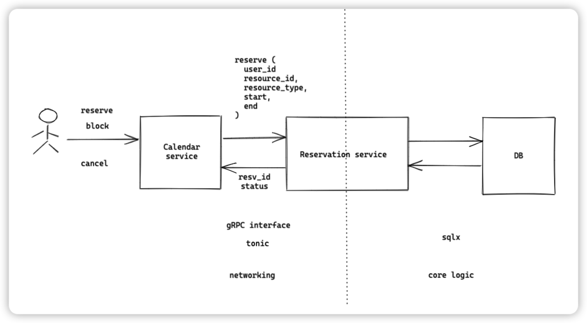

# Feature

- Feature Name: (reservation service core features)
- Start Date: (2022-10-25)

## Summary

a reservation service that allows users to reserve a resource for a certain period of time by gRPC. the service should provide a way to add and remove reservations, as well as a way to query the reservations.

## Motivation

first time to write RFC document before the code written. so the motivation is to write a document that describes the core features of the reservation service.

## Guide-level explanation

Basic architecture:


gRPC description:

```proto
    enum ReservationStatus {
    UNKNOWN = 0;
    PENDING = 1;
    CONFIRMED = 2;
    BLOCKED = 3;
}

enum ReservationUpdateType {
    UNKNOWN = 0;
    CREATE = 1;
    UPDATE = 2;
    DELETE = 3;
}

message Reservation {
    string id = 1;
    string user_id = 2;
    ReservationStatus status = 3;

    // resource reservation window
    string resource_id = 4;
    google.protobuf.Timestamp start = 5;
    google.protobuf.Timestamp end = 6;

    // extra note
    string note = 7;
}

message ReserveRequest {
    Reservation reservation = 1;
}

message ReserveResponse {
    Reservation reservation = 1;
}

message UpdateRequest {
    string note = 2;
}

message UpdateResponse {
    Reservation reservation = 1;
}

message ConfirmRequest {
    string id = 1;
}

message ConfirmResponse {
    Reservation reservation = 1;
}

message CancelRequest {
    string id = 1;
}

message CancelResponse {
    Reservation reservation = 1;
}

message GetRequest {
    string id = 1;
}

message GetResponse {
    Reservation reservation = 1;
}

message QueryRequest {
    string resource_id = 1;
    string user_id = 2;
    // use status to filter result. If UNKNOWN, return all reservations
    ReservationStatus status = 3;
    google.protobuf.Timestamp start = 4;
    google.protobuf.Timestamp end = 5;
}

message ListenRequest {}
message ListenResponse {
    int8 op = 1;
    Reservation reservation = 2;
}

service ReservationService {
    rpc reserve(ReserveRequest) returns (ReserveResponse);
    rpc confirm(ConfirmRequest) returns (ConfirmResponse);
    rpc update(UpdateRequest) returns (UpdateResponse);
    rpc cancel(CancelRequest) returns (CancelResponse);
    rpc get(GetRequest) returns (GetResponse);
    rpc query(QueryRequest) returns (stream Reservation);
    // another system could monitor newly added/confirmed/cancelled reservations
    rpc listen(ListenRequest) returns (stream Reservation);
}
```

**Database schema**
We use PostgreSQL as the database. The schema is as follows:

```sql
CREATE Schema rsvt;

CREATE TYPE rsvt.reservation_status AS ENUM ("none", 'pending', 'confirmed', 'blocked');
CREATE TYPE rsvt.reservation_update_type AS ENUM ("none", 'create', 'update', 'delete');

CREATE TABLE rsvt.reservations (
    id UUID NOT NULL DEFAULT gen_random_uuid(),
    user_id VARCHAR(64) NOT NULL,
    rstatus rsvt.reservation_status NOT NULL DEFAULT 'pending',
    resource_id VARCHAR(64) NOT NULL,
    rperiod TSTZRANGE NOT NULL,
    note TEXT,

    CONSTRAINT reservations_pkey PRIMARY KEY (id),
    CONSTRAINT reservations_conflict EXCLUDE USING gist (
        resource_id WITH =,
        rperiod WITH &&
    )
);

CREATE INDEX reservations_resource_id_idx ON rsvt.reservations (resource_id);
CREATE INDEX reservations_user_id_idx ON rsvt.reservations (user_id);

-- if user_id is null, find all reservations within during for the resource
-- if resource_id is null, find all reservations within during for the user
-- if both are null, find all reservations within during
-- if both set, find all reservations within during for the resource and user
CREATE OR REPLACE FUNCTION rsvt.query(uid text, rid text, during: TSTZRANGE) RETURNS TABLE rsvt.reservations AS $$
    SELECT * FROM rsvt.reservations
    WHERE user_id = uid AND resource_id = rid AND rperiod && during
$$ LANGUAGE plpgsql;

-- resevation change queue
CREATE TABLE rsvp.reservation_changes (
    id SERIAL NOT NULL,
    reservation_id uuid NOT NULL,
    op rsvp.reservation_update_type NOT NULL,
);

-- trigger for add/update/delete a reservation
CREATE OR REPLACE FUNCTION rsvp.reservations_trigger() RETURNS TRIGGER AS $$
BEGIN
    IF TG_OP = 'INSERT' THEN
        -- update reservation_changes
        INSERT INTO rsvp.reservation_changes (reservation_id, op) VALUES (NEW.id, 'create');
    ELSIF TG_OP = 'UPDATE' THEN
        -- if status changed, update reservation_changes
        IF OLD.status <> NEW.status THEN
            INSERT INTO rsvp.reservation_changes (reservation_id, op) VALUES (NEW.id, 'update');
        END IF;
    ELSIF TG_OP = 'DELETE' THEN
        -- update reservation_changes
        INSERT INTO rsvp.reservation_changes (reservation_id, op) VALUES (OLD.id, 'delete');
    END IF;
    -- notify a channel called reservation_update
    NOTIFY reservation_update;
    RETURN NULL;
END;
$$ LANGUAGE plpgsql;

CREATE TRIGGER reservations_trigger
    AFTER INSERT OR UPDATE OR DELETE ON rsvp.reservations
    FOR EACH ROW EXECUTE PROCEDURE rsvp.reservations_trigger();
```

## Reference-level explanation

N/A

## Drawbacks

N/A

## Rationale and alternatives

N/A

## Prior art

N/A

## Unresolved questions

- how to handle repeated reservation? - is this more ore less a business logic which shouldn't be put into this layer? (non-goal: we consider this is a business logic and should be handled by the caller)
- if load is big, we may use an external queue for recording changes.
- we haven't considered tracking/observability/deployment yet.
- query performance might be an issue - need to revisit the index and also consider using cache.

## Future possibilities

TBD
